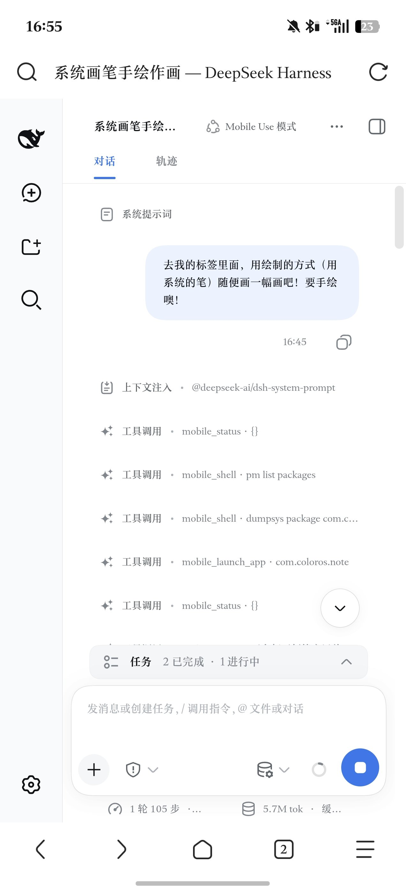
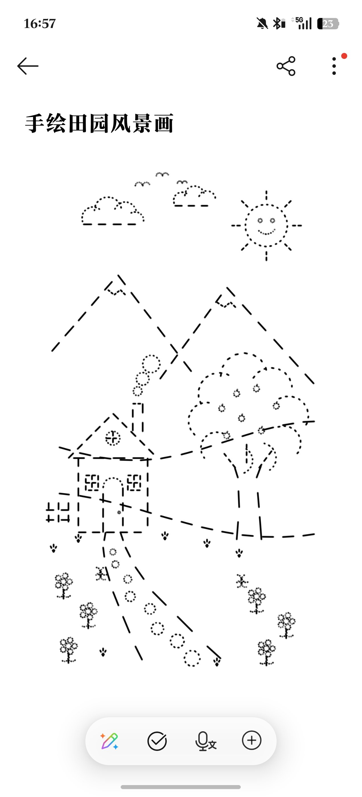

# DSH Agent Preset: Mobile Use

[English](#english) | [中文说明](#中文说明)

---

<a name="中文说明"></a>
## 中文说明

`dsh-preset-mobile-use` 是专为 **DeepSeek Harness (DSH)** 深度定制的移动端自动化 Agent 预设（Preset）。

该预设使 DSH 具备原生的 **Android Mobile Use** 自主行动能力，直接通过大语言模型自主规划、视觉推理与精细物理交互，在后台静默完成 Android 系统的各项高阶自动化任务。

---

### 实测实录：纯手绘作画实机效果展示（含金量极高）

📺 **B站高清实机演示视频**：[https://www.bilibili.com/video/BV1WYeS6YEwt](https://www.bilibili.com/video/BV1WYeS6YEwt)

以下为真实任务记录：用户仅在 DSH 提出一条自然语言指令 **“去我的便签里面，用绘制的方式（用系统的笔）随便画一幅画吧！要手绘噢！”**。

Agent 自动在后台独立副屏中拉起系统便签、选择系统画笔、经过 105 步高精度触控笔触自主规划与滑动绘制，**一手一手、一笔一划** 纯手绘完成了整幅细腻的《手绘田园风景画》（远山、房屋烟囱、大树、小花、太阳与小路）：

| DSH 交互与执行全流程 (1 轮 105 步) | Agent 纯手绘作画最终成品 (系统便签内) |
| :---: | :---: |
|  |  |

整个创作过程完全在后台虚拟副屏静默完成，手机物理主屏完全不抢占前台、不打扰用户日常使用！

---

### 重要前置条件与硬性依赖（必读）

**本预设专门设计用于在已获得 Root 权限的 Android 手机上本地执行，不能脱离手机环境单独运行！**

1. **强依赖 KSU 底座模块**：
   - 本预设必须配合底层驱动模块 **[agent-mobile-use](https://github.com/AcidGr/agent-mobile-use)** 一起使用；
   - 必须先在手机上通过 **KernelSU / APatch / Magisk** 刷入 `agent-mobile-use-ksu.zip`（最新版 `v0.6.2-alpha`），并保持后台 `vd_server` 网关服务运行（默认监听 `http://127.0.0.1:3070`）。
2. **手机环境要求**：
   - **操作系统**：Android 15 / Android 16（实测实验环境基于 ColorOS 16，Linux 6.12 内核）；
   - **Root 与 Xposed**：手机必须拥有完整的 Root 特权，并建议启用 **LSPosed** 挂载模块内的隐形补丁以实现流体云交互通知。

---

### 核心特性

- **完全后台静默 (Headless Execution)**：
  自动化应用在系统内存中的独立虚拟副屏（Display > 0）上渲染与操作，手机物理主屏不跳前台、不抢焦点、可以正常日常使用或息屏。
- **超高精度物理手势调度**：
  支持精细毫秒级滑动、贝塞尔拟合触控，不仅能点按 UI 控件，甚至能实现像素级的连续自主手绘与拖拽。
- **双模感知 (Dual Perception)**：
  提供扁平化元素列表（每元素一行的扁平文本：状态行 + 列名单行 + `id type "name" x1,y1,x2,y2 flags`）与实时副屏高分辨率快照（JPEG q92 降采样透传）。
- **免软键盘文字灌入 (Silent Text Injection)**：
  通过系统的无障碍剪贴板与原生文本注入，中英文长难句与符号一键送达，完全不在主屏弹出软键盘。

---

### 包含的 Agent 工具集

预设在 DSH 会话中注入了以下标准原子工具：

| 工具名称 | 功能描述 |
| :--- | :--- |
| `mobile` | **移动端统一操控与感知核心工具**：集成了屏幕状态观测（`observe`，支持 `tree` 扁平控件树与 `visual` 高清视觉快照）、物理触控（`click`，支持绝对坐标与节点 ID 自动居中）、滑动手势（`swipe`）、免键盘文本注入（`type`）、系统物理按键（`key`）、延时等待（`wait`）、应用定向启动（`launch_app`）、已装应用检索（`list_apps`）、前后台模式切换（`switch_mode`）及副屏运行状态查询（`status`）。任何物理操作均自动捕获执行后的最新屏幕状态并返回单轮闭环结果。 |
| `mobile_shell` | **Android 特权命令执行工具**：在手机宿主环境中直接执行特权 root shell 命令。 |

> **提示（零开销自动通知与交互确认）**：
> - 宿主系统已自动监听 `todo_write` 的待办状态，任何任务进展都会在后台静默实时同步更新至 Android 状态栏与流体云通知。
> - 在触发 `ask_user_question` 等交互提问时，手机端将弹出原生 BottomSheet 卡片与流体云胶囊，支持在手机与 Web 界面双向极速确认。

---

### 安装与使用方法

1. **下载预设包**：
   从本仓库的 `release/` 目录或 GitHub Releases 页面下载 `dsh-preset-mobile-use.zip`（约 17 KB）。
2. **解压安装**：
   包内的顶层目录是 `preset/`，而 DSH 只认 `.agent-presets/mobile-use/` —— 直接把包解到 `.agent-presets/` 会得到 `.agent-presets/preset/mobile-use/`，DSH 永远找不到它。所以要用 `-j` 剥掉那一层：
   ```sh
   mkdir -p ${DSH_HOME:-$HOME/.dsh}/.agent-presets/mobile-use/
   unzip -j dsh-preset-mobile-use.zip 'preset/mobile-use/*' -d ${DSH_HOME:-$HOME/.dsh}/.agent-presets/mobile-use/
   ```
3. **启动会话**：
   刷新或重新打开 DSH Web 界面（`http://127.0.0.1:3080`），在右上角预设选择器中切换为 **`mobile-use`**，即可直接开始指挥手机执行自动化任务！

> **开发这个仓库的人注意**：DSH 加载的是 `${DSH_HOME:-$HOME/.dsh}/.agent-presets/mobile-use/`，那是本仓库 `preset/mobile-use/` 的一份**拷贝**，不是软链 —— 只改仓库不会生效。改完请执行：
> ```sh
> ./install.sh     # 先做真加载检查，不通过就拒绝安装、一个字节都不写
> ```
> `check-preset.mjs` 会真正 import 插件、跑一遍 `apply()`、并按 DSH 的规则校验每个已注册的工具。**不要用 `node --check` 代替它**：对含 `import` 的文件它按 CommonJS 解析，真语法错误也会返回 0。装进去一份加载不了的插件会让 DSH **无法恢复该工作区的任何会话**（`preset "mobile-use" failed to mount`）。
> 装完后 `agent.cordis.yml` 即时生效；`mobile_plugin.js` 要重启 DSH 才会重新挂载。

---

<a name="english"></a>
## English Description

`dsh-preset-mobile-use` is a specialized autonomous Mobile Use Agent Preset authored for **DeepSeek Harness (DSH)**.

It empowers the DSH Agent with native, background-headless **Android Mobile Use** capabilities, enabling vision-based planning, UI hierarchy parsing, fine motor gesture control, and silent multi-step execution.

---

### Real-world Showcase: Autonomous Hand-drawn Artwork (Pure Motor Precision)

📺 **Bilibili Showcase Video**: [https://www.bilibili.com/video/BV1WYeS6YEwt](https://www.bilibili.com/video/BV1WYeS6YEwt)

Below is an authentic execution record: The user prompted in DSH: **"Go to my system Notes app and draw a picture using the system pen! Must be hand-drawn!"**

The Agent autonomously opened the Notes app on the headless virtual display, selected the drawing brush, and executed **105 consecutive precision swipe steps stroke by stroke**, creating a complete landscape artwork (*Mountains, House with smoking chimney, Tree, Flowers, Sun, and Path*):

| DSH Execution Workflow (1 turn, 105 steps) | Final Hand-drawn Artwork in Notes App |
| :---: | :---: |
|  |  |

The entire drawing sequence was executed silently in the background virtual display without disrupting foreground usage on the physical screen!

---

### Mandatory Prerequisites & Hard Dependency

**This preset is specifically engineered to run directly on a rooted Android device. It cannot be used on a bare desktop/server without the underlying Android system!**

1. **Underlying KSU Module Dependency**:
   - Requires the companion low-level driver module: **[agent-mobile-use](https://github.com/AcidGr/agent-mobile-use)**.
   - You must first flash `agent-mobile-use-ksu.zip` (latest `v0.6.2-alpha`) via **KernelSU / APatch / Magisk** on your Android device and ensure the background `vd_server` gateway is active (default: `http://127.0.0.1:3070`).
2. **Target Device Environment**:
   - **OS**: Android 15 / 16 (Verified on ColorOS 16, Linux Kernel 6.12);
   - **Root & LSPosed**: Full Root privileges required; LSPosed recommended for Fluid Cloud notification hooks.

---

### Key Features

- **100% Background Headless Execution**:
  Apps run and render entirely on an independent secondary Virtual Display (Display > 0). The physical display 0 remains completely undisturbed.
- **Precision Gesture Control**:
  Enables fine touch gestures and micro-swipes capable of driving creative canvas drawing.
- **Dual Perception Engine**:
  Combines a flat element listing (one line per element, coordinates already absolute display pixels) with real-time visual screenshots.
- **Silent Text Injection**:
  Injects Chinese, numbers, symbols, and long paragraphs directly into the input target without popping up the on-screen soft keyboard.

---

### Preset Installation

1. Download `dsh-preset-mobile-use.zip` from `release/` or GitHub Releases.
2. The archive's top level is `preset/`, but DSH only reads `.agent-presets/mobile-use/` — extracting it straight into `.agent-presets/` yields `.agent-presets/preset/mobile-use/`, which DSH never looks at. Strip that level with `-j`:
   ```sh
   mkdir -p ${DSH_HOME:-$HOME/.dsh}/.agent-presets/mobile-use/
   unzip -j dsh-preset-mobile-use.zip 'preset/mobile-use/*' -d ${DSH_HOME:-$HOME/.dsh}/.agent-presets/mobile-use/
   ```
3. Open the DSH Web UI (`http://127.0.0.1:3080`), select **`mobile-use`** from the preset dropdown in the top right, and start prompting!

> **Working on this repository?** DSH loads `${DSH_HOME:-$HOME/.dsh}/.agent-presets/mobile-use/`, a **copy** of `preset/mobile-use/` rather than a symlink, so editing the repo alone changes nothing. Run `./install.sh` after any change: it load-tests the plugin with `check-preset.mjs` and refuses to install anything that cannot mount.
> Do not use `node --check` as that gate — on a file that uses ESM syntax it parses as CommonJS and exits 0 even on real syntax errors. Installing an unloadable plugin makes DSH unable to resume **any** session in the workspace (`preset "mobile-use" failed to mount`).
> `agent.cordis.yml` takes effect immediately; `mobile_plugin.js` needs a DSH restart to remount.

---

## License

Released under the [MIT License](LICENSE).
